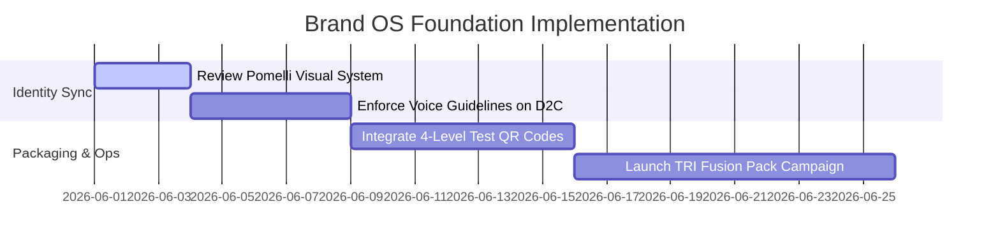

# ATRI BRAND BOOK
## Division: Brand OS | Document: 01_Brand_Book.md

---

## 1. Specialist Agent Analysis & Alignment

### A. Brand Strategy Agent
ATRI is positioned as India's most trusted premium performance nutrition ecosystem. Our core objective is to move performance nutrition from the dark, untruthful "gym-bro" domain to an aspirational, scientific, and premium lifestyle tier. We do not sell protein; we sell verified physical capability.

### B. Consumer Psychology Agent
Our target audience experiences profound skepticism due to the prevalence of fake supplements, digestion issues (bloating, acne), and hidden blends. By using a **Trial-First strategy** (TRI Fusion Pack) and promoting radical transparency (4-level lab testing), we satisfy the customer's need for safety, control, and immediate sensory verification.

### C. Sports Nutrition & Supplement Industry Expert
True athletic performance requires a gut-friendly digestive environment. Modern athletes understand that absorption is just as important as intake. True Whey's pure concentrate formulation and BCAA/Pre-workout profiles are specifically optimized for athletic performance without artificial fillers or hidden chemical blends.

### D. Copywriting & Creative Director Agent
Our copy must read with **holistic sophistication**. Aligned with the Pomelli Brand Book, our style is **Direct, Professional, Goal-oriented, and Reliable**. We speak like an elite sports scientist or a high-performance WHOOP/Apple editorial team—calm, confident, clean, and highly sophisticated.

---

## 2. Brand Positioning & Core Findings

### A. The Core Mission
To build India’s most trusted premium performance nutrition ecosystem. We pledge absolute, uncompromising formulation transparency and gut-friendly sports science.

### B. What ATRI is NOT vs. What ATRI IS
| ATRI IS NOT 🚫 | ATRI IS 🏆 |
| :--- | :--- |
| A bodybuilding brand shouting about "mass gains" | A premium performance nutrition company for high-performers |
| A discount supplement company pushing cheap formulas | A premium, science-first aspirational brand |
| A mass-market whey protein company with generic packaging | A dark luxury performance culture ecosystem |
| Dependent on proprietary hidden blends | Transparently formulated and 4-Level tested |

### C. Target Customer Personas
1.  **The Corporate Athlete:** High-earning professional (25-45). Runs marathons, plays weekly football, uses WHOOP/Oura. Values discipline, gut comfort, and cognitive performance.
2.  **The Competitive Footballer / Runner:** Aspiring or academy-level athlete (16-30). Demands pure hydration, clean energy without heart-racing crashes, and rapid recovery formulas.
3.  **The Modern Creator / Entrepreneur:** Tech-savvy creator who works high-stress hours. Values routines, sleep recovery, and premium, clutter-free aesthetics.

---

## 3. Strategic Recommendations

*   **Establish "The Real Inside" as a Trust Shield:** Transform the tagline from a static slogan into an interactive brand promise. Embed a QR code on every TRI Fusion Pack linking directly to the batch's specific, independent 4-Level lab report.
*   **Decouple from "Gym-Bro" Channels:** Focus D2C marketing on premium fitness clubs, amateur football leagues, corporate wellness programs, and high-end running events.
*   **Trial-First Acquisition Loop:** Keep the TRI Fusion Pack as the exclusive entry SKU for first-time buyers. Do not allow first-time purchases of bulk tubs without experiencing the trial pack first, reinforcing premium exclusivity and safety.

---

## 4. Implementation Roadmap

1.  **Stage 1: Asset Auditing & Enforce Tone (Week 1):** Align all digital assets (website, founder social, emails) with the Pomelli Brand Book guidelines.
2.  **Stage 2: Transparency Operations (Week 2-3):** Implement the live 4-level test registry database on the D2C website.
3.  **Stage 3: Premium Scaling (Week 4+):** Introduce the brand system to corporate athletic cohorts and premium academy ambassadors.

---

## 5. Standard Operating Procedures (SOPs)

### SOP-BR-01: Copywriting Tone & Compliance
*   **Objective:** Ensure all outward-facing copy aligns with the ATRI brand personality.
*   **Step-by-Step Execution:**
    1.  **Auditing Tone:** Before publishing, check copy against the **Pomelli Brand Voice scale** (Direct, Professional, Goal-oriented, Reliable).
    2.  **Restricted Words Check:** Eliminate all occurrences of "Gym-bro" vocabulary. Refer to the table below:
        *   *Instead of:* "Get massive / bulk up" -> *Use:* "Optimize physical recovery / enhance output"
        *   *Instead of:* "Insane muscle pump" -> *Use:* "Clean endurance and cognitive focus"
        *   *Instead of:* "Cheap prices / discount sale" -> *Use:* "Premium trial-first access"
    3.  **Readability Check:** Keep sentences short, assertive, and educational. Avoid hyperbole and empty exclamation marks.

---

## 6. Automation Opportunities

*   **Real-time Lab Registry Synchronization:** Set up an automation between our third-party testing laboratory and our Shopify backend via Zapier. Once a batch test is marked passed, a PDF report is automatically generated and linked to the batch QR code on the packaging.
*   **AI Brand Compliance Guardrail:** Implement a custom Llama/GPT-4 prompt inside the marketing copy workflow to automatically audit and rewrite ad drafts, ensuring 100% brand voice alignment with the Pomelli Brand Book guidelines.

---

## 7. Key Performance Indicators (KPIs)

*   **Brand Sentiment Index (BSI):** Targeted at **>92% positive** across social channels.
*   **Net Promoter Score (NPS):** Minimum benchmark of **+75** for the TRI Fusion Pack unboxing experience.
*   **Trial-to-Subscription Conversion Rate:** Targeting **>18%** of TRI Fusion Pack trialists upgrading to bulk monthly subscriptions within 21 days.

---

## 8. Execution Priorities

1.  **Priority 1 (Immediate):** Deploy the copywriting tone SOP to all copywriters and the social media agency team.
2.  **Priority 2 (High):** Re-design packaging labels to include the batch QR code pointing directly to the online 4-level lab registry database.
3.  **Priority 3 (Medium):** Standardize the "What's inside matters" onboarding emails for new TRI Fusion Pack purchasers.
