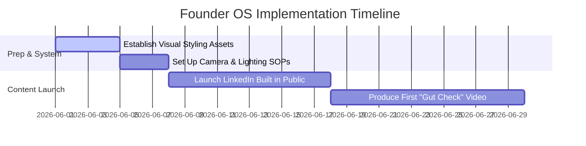

# THE REAL INSIDE FOUNDER BRAND BOOK
## Division: Founder OS | Document: 02_Founder_Brand_Book.md

---

## 1. Specialist Agent Analysis & Alignment

### A. Founder Branding Agent
Vedansh Vijay is positioned not as an influencer, but as a young visionary founder-operator leading the future of modern Indian performance culture. His personal brand serves as the trust anchor for THE REAL INSIDE. His branding must mirror the calm, disciplined, and premium tone of the product.

### B. Social Media & Copywriting Agent
The tone of the founder must be authentic, direct, clean, and highly educational. We avoid sensationalism and clickbait hooks. Instead, the founder writes with quiet confidence, sharing raw numbers, scientific truths, and structural startup challenges.

### C. Consumer Psychology Agent
Modern consumers connect with people, not logos. By showing the inner workings of THE REAL INSIDE—our sourcing, lab test failures, product iteration, and manufacturing setups—Vedansh establishes an unbreakable bond of trust that no faceless MNC can compete with.

---

## 2. Founder Persona & Core Findings

### A. Core Profile
*   **Name:** Vedansh Vijay
*   **Tagline / Title:** Face of Modern Indian Performance Culture | Founder of THE REAL INSIDE
*   **Personality Attributes:** Disciplined, ambitious, calm, highly intelligent, trustworthy, premium, modern.
*   **Core Narrative:** A young, disciplined visionary builder who noticed the toxic, untruthful, and digestively harmful formulations of massive generic supplement brands, and decided to engineer a gut-friendly, transparent performance nutrition ecosystem built for modern high-performers.

### B. Personal Brand Pillars
1.  **Building in Public (Transparency):** Documenting the operations, formulation changes, batch testing, and team growth of THE REAL INSIDE.
2.  **Performance Lifestyle & Discipline:** Showcasing early morning routines, athletic training (specifically amateur/elite football), cognitive workflows, and sleep recovery.
3.  **Modern Indian Athlete Culture:** Highlighting underfunded Indian sports, football academy challenges, and sports nutrition science education.

---

## 3. Strategic Recommendations

*   **Establish a Weekly "Building THE REAL INSIDE" Series:** Publish a high-value weekly narrative thread on LinkedIn and Twitter detailing the raw startup journey (e.g., margins, sourcing challenges, ingredient tasting, and testing certificates).
*   **The Founder's "Gut Check" Campaign:** Launch video essays where Vedansh breaks down why standard market whey proteins cause bloating, detailing the exact biochemistry behind lactose intolerance, filler agents, and THE REAL INSIDE's gut-friendly solutions.
*   **Premium Podcasting (Quality over Quantity):** Host a monthly video podcast interviewing elite Indian athletes, sports nutrition scientists, and visionary builders. Maintain WHOOP/Apple cinematic visuals (low-light, clean studio setup).

---

## 4. Implementation Roadmap

1.  **Phase 1: Foundation (Week 1):** Define the visual framing guide (high-contrast dark backgrounds, copper hues, cinematic lighting) and script writing templates.
2.  **Phase 2: Text Launch (Weeks 2-3):** Initiate a 3-times-a-week LinkedIn and Twitter publishing schedule.
3.  **Phase 3: Video Engine (Weeks 4+):** Begin producing cinematic YouTube and Instagram video essays focused on athletic discipline and nutrition science.

---

## 5. Standard Operating Procedures (SOPs)

### SOP-FO-01: Founder Social Writing & Recording Protocol
*   **Objective:** Maintain a premium, highly disciplined personal image across all formats.
*   **Writing Guidelines:**
    1.  **The Hook:** Start with an intriguing, quiet statement. *Avoid:* "OMG! Look at what this supplement brand is hiding..." *Use:* "India's supplement industry has a hidden formulation problem. Here is the data."
    2.  **Paragraph Structure:** Short blocks of text. Max 2 sentences per paragraph.
    3.  **Tone Alignment Check:** Ensure there is no boastful, hyper-polite, or "gym-bro" vocabulary. Focus on the raw data, science, and the operational truth.
*   **Visual Recording Guidelines:**
    1.  **Backdrop:** Minimalist dark studio environment. Sleek furniture with subtle copper lighting accents.
    2.  **Attire:** Sophisticated, high-performance clean athletic wear or modern minimalist clothing (neutral colors only).

---

## 6. Automation Opportunities

*   **Omnichannel Distro Automation:** Set up a pipeline where a long-form video script recorded by Vedansh is automatically parsed by an AI model to output:
    1.  A structured LinkedIn text post
    2.  A 5-tweet Twitter thread
    3.  An educational script for Instagram Reels
    All drafts are automatically populated in Notion for final approval.
*   **Scientific Database Sync:** Connect the founder's research database (Notion) to a webhook that alerts the scriptwriter when new peer-reviewed sports science articles are published regarding gut health or football nutrition, prompting fresh education posts.

---

## 7. Key Performance Indicators (KPIs)

*   **Founder Share of Voice (SoV):** Targeted at **25%** within Indian performance nutrition startup founder conversations.
*   **LinkedIn Engagement Rate:** Maintain an average engagement rate of **>6.5%** per post.
*   **Inbound Business Inquiries:** Tracking strategic partnership requests (academies, professional footballers, fitness clubs) driven directly by founder content (target: **5+ high-value leads per month**).

---

## 8. Execution Priorities

1.  **Priority 1 (Immediate):** Write and schedule the first 3 "Building in Public" LinkedIn posts detailing the formulation of True Whey.
2.  **Priority 2 (High):** Script and storyboard the 3-minute launch video essay: *"Why I Started THE REAL INSIDE (And Why What's Inside Matters)"*.
3.  **Priority 3 (Medium):** Establish the visual guidelines and lighting presets with the videographer.
