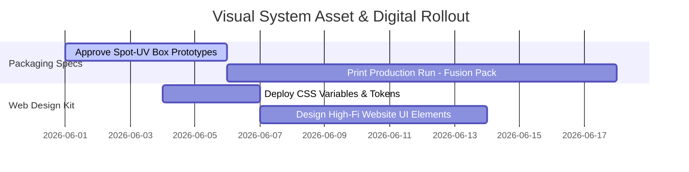

# THE REAL INSIDE VISUAL IDENTITY SYSTEM
## Division: Brand OS | Document: 03_Visual_Identity_System.md

---

## 1. Specialist Agent Analysis & Alignment

### A. Creative Director & UI/UX Agent
The visual identity of THE REAL INSIDE bridges high-contrast dark luxury with warm, copper-elegance organic tones. Aligned with the Pomelli Brand Book, we utilize specific typography (Playfair Display for high-editorial authority, Montserrat for structural precision) to command immediate attention. The spacing must follow a rigid minimalist grid to communicate scientific precision.

### B. Product Strategy Agent
The packaging of the TRI Fusion Pack serves as a primary physical billboard. The packaging uses high-contrast typography, premium sensory finishes (matte soft-touch coating), and copper-foiled typography accents. Every visual touchpoint must feel premium and state of the art, completely eliminating standard plastic jar aesthetics.

### C. Consumer Psychology Agent
Colors evoke physiological responses. Canyon Clay and Marsala Red suggest premium grounded performance (organic, scientific, earthy, gut-safe), while Soft Pink and Antique Rose introduce a soft elegance (clean, trustworthy, recovery-focused). By avoiding high-saturation neon greens and bright blues common in gym products, THE REAL INSIDE visually stands out as clean and transparent.

---

## 2. Visual Identity Design Tokens

### A. Core Color Palette
| Token Name | HEX | RGB | HSL | Intended Usage |
| :--- | :--- | :--- | :--- | :--- |
| **Deep Obsidian (Base)** | `#0A0A0B` | `10, 10, 11` | `240, 5%, 4%` | Main dark background and dark interface canvas |
| **Canyon Clay** | `#B85F48` | `184, 95, 72` | `12.32, 44.09%, 50.2%` | Primary active accent, product headers, key buttons |
| **Soft Pink** | `#F8D7D9` | `248, 215, 217` | `356.36, 70.21%, 90.78%`| Light backgrounds, subtle card overlays, trust indicators |
| **Antique Rose** | `#E6A2A4` | `230, 162, 164` | `358.24, 57.63%, 76.86%`| Recovery callouts, interactive states, secondary buttons |
| **Marsala Red** | `#7F4E3E` | `127, 78, 62` | `14.77, 34.39%, 37.06%`| Warm dark sections, premium typography, borders |
| **Off-White (Chalk)** | `#FBFBFB` | `251, 251, 251` | `0, 0%, 98.43%` | Primary text and high-contrast typography elements |

### B. Core Typography Rules
*   **Primary Display Typography (Headings, Hero Titles, Main Category Headers):**
    *   **Font Family:** `Playfair Display` (Serif)
    *   **Styling:** Medium / Semi-Bold.
    *   **Letter Spacing:** `-0.01em`
    *   **Role:** Establishes highly sophisticated, editorial authority.
*   **Secondary Body Typography (Paragraphs, Tech Specs, Interface Labels, CTA text):**
    *   **Font Family:** `Montserrat` (Sans-Serif)
    *   **Styling:** Regular / Medium.
    *   **Letter Spacing:** `0.02em` to `0.05em`
    *   **Role:** Ensures clean readability, modern geometric structure.

---

## 3. Strategic Recommendations

*   **Implement "Fluid Minimalism" Layouts:** All web and print media must use wide, structural margins (8% of viewport width) with generous padding (80px–120px vertical spacers) to simulate premium retail environments (similar to Apple and WHOOP).
*   **Tactile Packaging Enhancements:** Enforce soft-touch matte lamination on the TRI Fusion Pack box, using spot-UV gloss over the liquid copper swirls and embossed hot-foil copper stamping on the "THE REAL INSIDE" logo.
*   **Strict Image Filter Guidelines:** All brand photography (athlete culture, ingredients, unboxing) must have desaturated, high-contrast, moody dark environments with natural warm light highlights, avoiding flat white-box studio lighting.

---

## 4. Implementation Roadmap

1.  **Phase 1: Token Standardization (Week 1):** Deploy CSS variables and Figma design tokens matching the HEX and typography scale.
2.  **Phase 2: Packaging Sign-off (Week 2):** Finalize and print-proof the 9-sachet layout box for the TRI Fusion Pack.
3.  **Phase 3: Digital Integration (Weeks 3-4):** Complete all Shopify UI component updates using the updated palette.

---

## 5. Standard Operating Procedures (SOPs)

### SOP-VI-01: Asset Design & Compliance Auditing
*   **Objective:** Ensure every digital/physical graphic adheres to the visual identity guidelines.
*   **Step-by-Step Execution:**
    1.  **Color Verification:** Open design software and ensure all color values match the official color table. Do not use generic high-saturation red, blue, or absolute pure white (`#FFF`).
    2.  **Typography Lockup:**
        *   Headings MUST use `Playfair Display`.
        *   Body copy and labels MUST use `Montserrat`.
        *   Ensure heading-to-body font contrast ratios are strictly **>1:2.5** in size.
    3.  **Layout Padding Check:** Ensure all designs have a minimum of **24px gutter padding** for mobile and **64px gutter padding** for desktop. No visual elements should touch the viewport edges.

---

## 6. Automation Opportunities

*   **Figma-to-GitHub Token Sync:** Set up a GitHub Action linked to the Figma Tokens plugin. When the design team updates a visual variable in Figma, the action automatically commits the updated CSS variables into the THE REAL INSIDE Shopify theme repository, preventing developer styling drift.
*   **Automated Image Quality Classifier:** Utilize an AI vision script that automatically analyzes uploaded marketing assets. It flags and blocks any image that doesn't fit the specified color profile (Deep Obsidian + Brushed Copper) or exhibits flat lighting.

---

## 7. Key Performance Indicators (KPIs)

*   **Visual Trust Index:** Targeting **>95%** in customer post-checkout surveys when asked "Does the product matching/packaging look premium?"
*   **Visual Retention Score (Bounce Rate):** Keep the homepage bounce rate below **26%** by leveraging instant-load, premium visual layouts.
*   **CTR on Ad Creatives:** A minimum **>3.2%** Click-Through Rate on premium dark-luxury lifestyle meta ad creatives.

---

## 8. Execution Priorities

1.  **Priority 1 (Immediate):** Initialize the global styling sheet (`index.css`) containing all visual system typography rules and color variables.
2.  **Priority 2 (High):** Re-export all Figma source designs for packaging using the exact Pomelli color hexes.
3.  **Priority 3 (Medium):** Complete and review the visual guidelines handbook for UGC creators.
