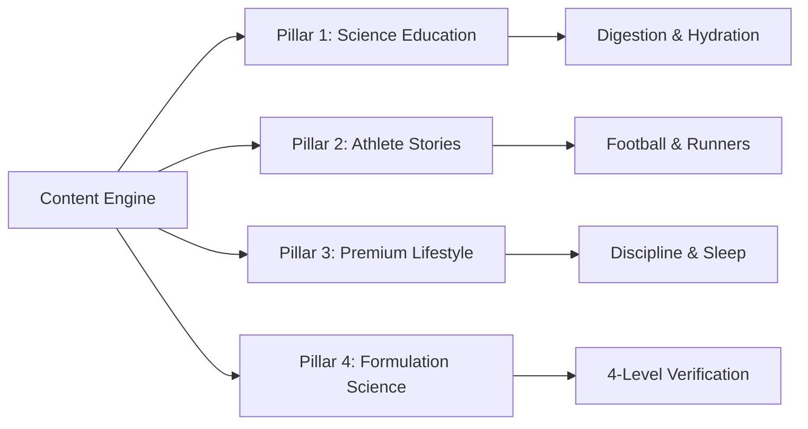
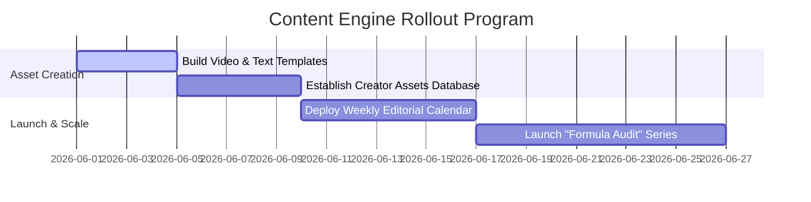

# THE REAL INSIDE CONTENT PLAYBOOK
## Division: Marketing OS | Document: 04_Content_Playbook.md

---

## 1. Specialist Agent Analysis & Alignment

### A. Marketing & Social Media Agent
The THE REAL INSIDE content engine operates as a high-value media channel rather than an advertisement feed. We educate first, inspire second, and sell third. Content must feel editorial, peer-reviewed, and beautifully styled, adhering strictly to the Pomelli design values (Canyon Clay tones, clean layouts).

### B. Consumer Psychology & Trend Analysis Agent
Consumers have ad blindness. By structuring content around the psychology of "intellectual value" (deep biochemical explanations of digestive enzymes, amino acid uptake ratios, lactic acid buffering), we convert skepticism into deep scientific trust.

### C. Sports Nutrition & Football Specialist
Our product education must focus heavily on practical application: "Why classic pre-workout causes gastric distress during high-intensity football sprints," or "Why pure concentrate whey without artificial thickeners absorbs 2x faster post-match." This provides immediate utility.

---

## 2. Content Pillars & Key Findings

### A. The Four Core Pillars

1.  **Pillar 1: Science Education (50% Distribution):** Gut-friendly performance, hydration mechanics, recovery cycles, and nutrition science.
2.  **Pillar 2: Athlete Stories (20% Distribution):** Spotlighting professional and academy footballers, high-performance runners, real unboxing transformations, and athletic grit.
3.  **Pillar 3: Premium Lifestyle (15% Distribution):** Daily physical routines, cognitive focus protocols, sleep/recovery hacks, and high-discipline habits.
4.  **Pillar 4: Product Formulation Science (15% Distribution):** Transparent raw materials, heavy metals testing breakdowns, and deep ingredient deep-dives.

### B. Findings on High-Performing Formats
*   **Video Essays (60-90s):** High-definition cinematic shorts using wide lenses, low-saturation obsidian palettes, and educational, data-driven voiceovers.
*   **Scientific Carousels:** Highly designed, text-first technical slides explaining muscle protein synthesis, comparing whey concentrate vs. isolate, or hydration charts.
*   **Founder "Behind-The-Build" Vlog:** Behind-the-scenes laboratory tours, ingredient raw sourcing diaries, and packaging reviews.

---

## 3. Strategic Recommendations

*   **Establish the "Formula Audit" Series:** Create short-form video formats where THE REAL INSIDE's sports nutritionists critically analyze standard commercial protein formulas, showing how hidden blends and thickeners cause bloating.
*   **Cinematic "Matchday Nutrition" Frameworks:** Produce stylized videos showing the timeline of an athlete's nutrition leading up to a football match (2 hours pre-match, halftime hydration, post-match recovery).
*   **Launch the THE REAL INSIDE Research Hub:** Compile monthly research digests translating complex scientific literature into actionable, beautiful infographics.

---

## 4. Implementation Roadmap

1.  **Stage 1: Production Systems (Week 1):** Create structural video design templates (font rules, lower thirds, copper-tone color grade LUTs).
2.  **Stage 2: Calendar Execution (Week 2):** Launch the recurring weekly posting schedule (4 reels/shorts, 3 carousel specs).
3.  **Stage 3: Scale & Refinement (Weeks 3-4):** Analyze weekly engagement data, continuously optimizing hooks based on performance.

---

## 5. Standard Operating Procedures (SOPs)

### SOP-CO-01: Educational Scriptwriting Pipeline
*   **Objective:** Write high-converting, scientifically authoritative video scripts.
*   **Structural Blueprint:**
    1.  **The Scientific Hook (0-5s):** Start with an anatomical or formulation truth that breaks common beliefs. *Example:* "90% of athletes bloating from whey aren't actually lactose intolerant. It’s the thickeners."
    2.  **The Core Problem (5-20s):** Explain the biological mechanism of why standard products cause issues (e.g., Xanthan gum lining the gut walls, slowing down amino absorption).
    3.  **The THE REAL INSIDE Solution (20-40s):** Explain how THE REAL INSIDE True Whey solves this by omitting artificial thickeners and using clean, gut-friendly enzymes.
    4.  **Scientific Call to Action (40-60s):** Avoid aggressive "buy now" sales language. *Use:* "Check the 4-level lab test for yourself. QR code is on our profile. What's inside matters."

---

## 6. Automation Opportunities

*   **Batch Editing Automation:** Build a cloud-based video editing pipeline (e.g., using Remotion or an automated video tool) that automatically overlays brand-approved captions, HSL Canyon Clay transitions, and watermark logo designs onto edited raw videos.
*   **Engagement-to-DM CRM Automation:** Set up automated comment triggers (using ManyChat). When a user comments "SCIENCE" on an educational post, the CRM instantly DMs them a stylized, comprehensive PDF guide regarding gut health and a discount trial code for the TRI Fusion Pack.

---

## 7. Key Performance Indicators (KPIs)

*   **Average Video View Duration:** Targeting **>65% retention rate** on 60-second educational videos.
*   **Save & Share Rate:** Total saves and shares representing **>12%** of total video reach (signaling deep educational value).
*   **DM Lead Inbound Conversion:** Achieving a **>15% click-to-trial rate** on automated DM PDF guides.

---

## 8. Execution Priorities

1.  **Priority 1 (Immediate):** Script the first 3 episodes of the "Formula Audit" video series.
2.  **Priority 2 (High):** Standardize the color grading LUT (copper accents, low-saturation Obsidian base) for videographers.
3.  **Priority 3 (Medium):** Build the automated Notion Editorial Hub with pre-configured hook structures.
