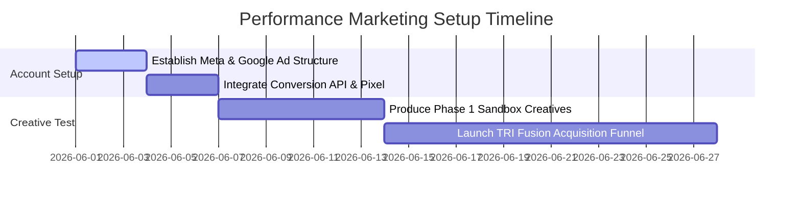

# ATRI MARKETING PLAYBOOK
## Division: Marketing OS | Document: 05_Marketing_Playbook.md

---

## 1. Specialist Agent Analysis & Alignment

### A. Performance Marketing, Meta & Google Ads Agents
To achieve efficient customer acquisition costs (CAC) for a premium D2C brand, our account architecture must prioritize consolidated broad targeting on Meta and high-intent keyword capture on Google Search. Creative is our primary targeting lever. We must run continuous asset testing using a structured grid of hooks and angles.

### B. Consumer Psychology Agent
Our audience is highly skeptical of "before/after muscle transformations." We leverage a different psychological trigger: **Risk Mitigation and Low Friction Trial**. By focusing ads strictly on the **TRI Fusion Pack** (a low-risk, high-credibility 3-day trial featuring 4-level independent test certification), we dramatically lower the barrier to entry while filtering out bargain hunters.

### C. Sports Nutrition & Football Specialist
Our ad hooks will highlight physical output metrics (e.g., buffering fatigue during high-intensity intervals, pre-match glycogen storage, recovery window absorption). We address the immediate symptoms of poor sports nutrition: stomach cramps, bloating, and post-workout lethargy.

---

## 2. Acquisition Campaign Blueprints

### Campaign 1: The TRI Fusion Pack Acquisition (Meta Ads)
*   **Objective:** Direct Response Acquisition (Conversion to Purchase).
*   **Audience:** Broad India (Ages 22-45), Interest layers: High-end sports (WHOOP, Garmin, Marathon running, Amateur football clubs, premium fitness).
*   **Hook 1:** "Stop committing supplement blind trust. Test what actually works for your gut first."
*   **Hook 2:** "3 days. 3 clean formulations. Zero bloating. The TRI Fusion Pack is here."
*   **Script Structure (UGC Video):**
    *   *0-3s Hook:* Show a close-up of a standard plastic supplement jar being thrown in a recycling bin. "I'm done wasting money on hidden blends that bloat my stomach."
    *   *3-15s Body:* Show the premium, copper-detailed TRI Fusion Pack. Unbox the 9 individual sachets. Explain: "This is ATRI. A trial-first ecosystem. 3 days of True Whey, TRI Power BCAA, and TRI Pump Pre-Workout. Clean ingredients, zero gums, zero fillers."
    *   *15-25s Social Proof / Trust:* Show the 4-level batch test registry QR code on the box side. "They are the first brand in India to individually test every batch for heavy metals and toxins."
    *   *25-30s CTA:* "Get your TRI Fusion Pack today for ₹599. Taste the difference. What's inside matters."
*   **Creatives:** High-definition lifestyle unboxing video (Obsidian color grade, copper accents).
*   **Ad Funnel:** Meta Ad -> Dedicated TRI Fusion Pack Landing Page -> Seamless 1-Step Checkout.

---

### Campaign 2: High-Intent Search Capture (Google Ads)
*   **Objective:** High-Intent Search Conversion (Targeting premium buyer search volume).
*   **Audience:** Users searching for high-quality, gut-friendly protein alternatives.
*   **Target Keywords:** *best gut friendly protein India, transparent whey protein, non bloating whey protein, tested heavy metal free supplement*.
*   **Ad Copy Structure:**
    *   *Headline 1:* ATRI™ True Whey - Lab Certified Gut-Friendly
    *   *Headline 2:* No Hidden Blends. No Bloating.
    *   *Headline 3:* 4-Level Tested for Heavy Metals
    *   *Description:* High-performance recovery engineered for premium athletes, professionals, and runners. Try the TRI Fusion Pack first. "What's inside matters." Free from artificial fillers.
*   **Ad Funnel:** Google Search Ad -> Ingredient Transparency Page -> E-commerce SKU Checkout.

---

### Campaign 3: The Founder's Build (Founder Brand Meta Ad)
*   **Objective:** Retargeting and High-Value Brand Awareness.
*   **Audience:** Custom warm audience (Website visitors last 30 days, Instagram engagers last 60 days).
*   **Script Structure (Vedansh Vijay Direct-to-Camera):**
    *   *0-5s Hook:* Vedansh sitting in a high-end minimalist dark studio. "I didn't start ATRI to compete in the gym-bro market. I started it because I was tired of getting bloated from massive generic whey proteins."
    *   *5-20s Story:* "When we built True Whey, we threw out xanthan gum, soy lecithin, and proprietary blends. We replaced them with premium grass-fed concentrate and digestive enzymes."
    *   *20-30s CTA:* "If you are ready for a premium, scientific approach to performance, try our 3-day Fusion Pack first. You don't have to trust us blindly. Look at the lab report yourself."
*   **Creatives:** A raw, highly professional 4K video essay.
*   **Ad Funnel:** Founder Video -> Brand Philosophy Page -> TRI Fusion Pack Checkout.

---

## 3. Strategic Recommendations

*   **Implement a "Broad-Only" Meta Strategy:** Do not choke the Facebook algorithm with hyper-specific interest groups. Focus on consolidated broad targeting and let high-quality, premium creative creatives do the targeting work.
*   **Rigid Creative Testing Matrix:** Test 3 distinct hooks against 2 distinct visual formats (lifestyle unboxing vs. scientific typography) in a weekly creative sandbox campaign.
*   **A/B Test Trial Pack Pricing:** Run a localized test comparing a price of ₹599 (with free shipping) against ₹499 (+ ₹99 shipping) to find the absolute sweet spot for CAC and average order value (AOV).

---

## 4. Implementation Roadmap

1.  **Phase 1: Architecture Setup (Week 1):** Deploy the consolidated Meta ad account structures and Google Conversion tracking.
2.  **Phase 2: Creative Delivery (Week 2):** Onboard UGC and founder assets to kickstart creative asset validation inside sandbox campaigns.
3.  **Phase 3: Scaling & Retargeting (Week 3+):** Scale winning creatives and launch the dynamic retargeting funnel with founder-led brand storytelling.

---

## 5. Standard Operating Procedures (SOPs)

### SOP-PM-01: Paid Acquisition Campaign Launch Protocol
*   **Objective:** Launch high-performance, structurally sound campaigns on Meta Ads.
*   **Step-by-Step Execution:**
    1.  **Naming Convention:** Enforce: `[ATRI] - [Acquisition/Retargeting] - [Broad/Warm] - [Creative Angle Name]`.
    2.  **Campaign Budget Optimization (CBO):** Turn CBO "ON" to let Meta automatically distribute budgets to high-performing ad sets.
    3.  **Visual Quality Check:** Check that video formatting is strictly 9:16 for Reels/Stories and 4:5 for feed ads. Verify color grade corresponds to the Deep Obsidian / Canyon Clay LUT presets.
    4.  **Destination Link Check:** Ensure all active links map to the dedicated TRI Fusion landing page with proper tracking parameters (`utm_source=meta&utm_medium=paid&utm_campaign=fusion_acquisition`).

---

## 6. Automation Opportunities

*   **Automated Budget Optimizer:** Deploy a Python management script utilizing Meta's marketing API. When an ad set CAC drops below ₹350 over a 48-hour period, automatically scale budget by 15%. If CAC exceeds ₹550, instantly throttle the budget and flag for creative review.
*   **Automated Review-to-Creative Pipeline:** Set up a database automation that collects 5-star unboxing reviews from Shopify. The system formats these reviews into brand-approved (Playfair Display typography) testimonial templates and uploads them to the Google Drive asset folder for the designer.

---

## 7. Key Performance Indicators (KPIs)

*   **Customer Acquisition Cost (CAC):** Target under **₹450** for the TRI Fusion Pack SKU.
*   **Return on Ad Spend (ROAS):** First-purchase blended ROAS target of **>1.8x**, scaling to **>3.5x** including 90-day repurchase cycles.
*   **Click-Through Rate (CTR):** Maintain a blended link click-through rate of **>2.5%** on acquisition ads.

---

## 8. Execution Priorities

1.  **Priority 1 (Immediate):** Verify and set up the Meta Pixel and Shopify Conversion API for deep data attribution.
2.  **Priority 2 (High):** Deliver the ad copy briefs for the first 3 trial pack acquisition reels to creators.
3.  **Priority 3 (Medium):** Establish the primary Google Search campaigns for high-intent brand query terms.
