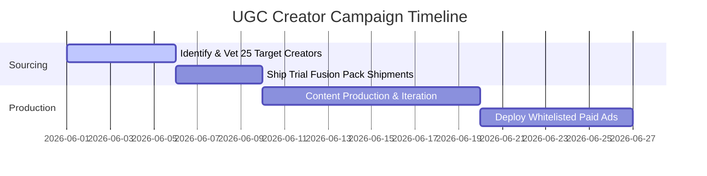

# ATRI UGC PLAYBOOK
## Division: Marketing OS | Document: 06_UGC_Playbook.md

---

## 1. Specialist Agent Analysis & Alignment

### A. UGC Specialist Agent
Most D2C brands fail at User Generated Content (UGC) because their videos feel scripted and artificial. ATRI UGC must feel authentic, visually gorgeous, and scientifically objective. Our creators are sports enthusiasts, footballers, and modern professionals who speak about fitness with calm intelligence.

### B. Creative Director & Website UX/UI Agent
UGC visual assets must respect our brand's **dark luxury and copper elegance visual codes**. While shot on iPhones, videos must maintain sophisticated lighting, clean background staging, and avoid flat kitchen-counter setups. Subtitles must use structural geometric sans-serif fonts in line with the Pomelli design layout.

### C. Consumer Psychology & Copywriting Agent
The key to converting UGC viewers is matching their inner skeptic. We script UGC using the **"Skeptic-to-Advocate" transition model**. The creator starts by voicing a common doubt (e.g., "I thought this trial-first box was just clever marketing..."), proceeds to verify the scientific ingredients, and finishes by showing their physical state and digestion improvements.

---

## 2. UGC Content Formats & Angles

### Angle 1: The "Bloat-Free Whey" Verification (Digestion Angle)
*   **Hook (0-3s):** "If you get bloating or acne from whey protein, you are probably drinking structural fillers." (Visual: Creator showing a bloated stomach or reading a standard protein tub's complex back label).
*   **Body (3-15s):** Creator unboxes ATRI True Whey from the TRI Fusion Pack. "ATRI throws out soy lecithin, thickeners, and gums. It's strictly 100% grass-fed concentrate with bromelain and papain digestive enzymes. It mixes like water, with zero clumping."
*   **Climax (15-25s):** Creator drinks the protein. "No stomach cramps, no bloating. Clean, gut-friendly absorption."
*   **CTA (25-30s):** "Stop settling for low-quality blends. Test the 3-day Fusion Pack first. What's inside matters."

---

### Angle 2: The "Amateur Football Matchday Prep" (Lifestyle Performance)
*   **Hook (0-3s):** "How I prepare my nutrition for 90 minutes of high-intensity football sprints." (Visual: Dynamic action shot of tying football boots or taking the field).
*   **Body (3-15s):** Creator mixes TRI Pump Drake 30 minutes pre-kickoff. "This isn't a gym-bro pre-workout that gives you itchy skin or heart palpitations. It has clean L-Citrulline, Beta-Alanine, and cognitive focus agents. Zero crash."
*   **Halftime Hydration (15-20s):** Creator drinks TRI Power BCAA at halftime. "Replenishing electrolytes and buffering lactic acid so my sprints don't die in the second half."
*   **CTA (20-30s):** "If you play high-intensity sports, you need sports nutrition built for performance. Get the TRI Fusion Pack."

---

### Angle 3: The 4-Level Lab Test Unboxing (Trust & Credibility)
*   **Hook (0-3s):** "This is the first supplement brand I've seen that actually lists independent heavy metal tests on their box." (Visual: Extreme close-up of scanning the batch QR code on the TRI Fusion Pack).
*   **Body (3-15s):** Show the mobile screen displaying the PDF lab registry showing negative results for Arsenic, Lead, Cadmium, and Aflatoxin. "ATRI tests every single batch for 4 distinct levels. Absolute formulation transparency."
*   **CTA (15-20s):** "Verify what's inside before you put it in your body. Try the Fusion Pack today."

---

## 3. Strategic Recommendations

*   **Implement Strict Creator Selection Criterions:** Do not work with generic fitness influencers who promote high-bulk muscle steroids. Source creators who are active marathon runners, corporate amateur footballers, yoga instructors, and nutrition science students.
*   **Enforce the "Aesthetic Environment" Contract clause:** All creators must sign a brief specifying filming environments (e.g., modern minimalist kitchen, high-end natural light gyms, outdoor turf fields) and lighting (natural warm side-lighting, zero harsh overhead lighting).
*   **UGC Whitelisting campaigns:** Run high-performing UGC creatives through the creators' own whitelisted social handles to double engagement rates and add third-party organic credibility.

---

## 4. Implementation Roadmap

1.  **Phase 1: Sourcing & Vetting (Week 1):** Scrape and select 25 creators matching the ATRI target athlete archetype.
2.  **Phase 2: Briefing & Shipments (Week 2):** Send out the custom Pomelli-inspired TRI Fusion packs alongside structured UGC scripts.
3.  **Phase 3: Launch & Testing (Weeks 3-4):** Validate incoming UGC assets within Meta Sandbox campaigns, scaling the top 3 high-converting hooks.

---

## 5. Standard Operating Procedures (SOPs)

### SOP-UG-01: Creator Vetting and Quality Control
*   **Objective:** Filter out low-quality influencers and ensure premium brand alignment.
*   **Step-by-Step Execution:**
    1.  **Engagement Vetting:** Check influencer metrics using an analytics tracker. Exclude accounts with fake followers (audit: comments-to-likes ratio must be **>2.5%**).
    2.  **Visual Alignment Audit:** Inspect the influencer's grid. If it features chaotic gym-bro memes, cheap packaging promotions, or messy room backdrops, reject the influencer immediately.
    3.  **Acoustic & Clarity Check:** Review previous videos. Ensure the audio is recorded with a professional lapel mic or clear voiceover setup. Muffled, echoing, or low-quality phone audio is strictly prohibited.

---

## 6. Automation Opportunities

*   **Creator CRM Automation:** Build a workflow inside Airtable linked to a Zapier trigger. When a creator is marked as "Approved" in the CRM, it automatically triggers:
    1.  A standard premium creator contract via DocuSign.
    2.  An automated address retrieval email.
    3.  A Shopify draft order for shipping the TRI Fusion Pack.
*   **UGC Asset File Management Automation:** Set up a Google Drive script linked to creator submissions. When a creator uploads their raw video and subtitled versions, the system automatically checks file formats (MP4/MOV, 9:16), names them by hook angle, and sends a Slack alert to the Media Buyer.

---

## 7. Key Performance Indicators (KPIs)

*   **Hook Rate (3s View Ratio):** Targeting a **>35%** view rate through the first 3 seconds of UGC ads.
*   **Cost Per Action (CPA):** Target CPA for trial purchase driven by UGC is **<₹400**.
*   **Creator Asset Yield:** Achieve a **>85%** rate of highly usable, brand-compliant creative assets from shipped promotional seedings.

---

## 8. Execution Priorities

1.  **Priority 1 (Immediate):** Draft and finalize the official visual styling brief document for UGC creators.
2.  **Priority 2 (High):** Seed the first batch of 15 TRI Fusion Packs to high-intent regional amateur footballers and marathoners.
3.  **Priority 3 (Medium):** Standardize the CapCut/Premiere branding template with Montserrat geometric text subtitles for creators to use.
