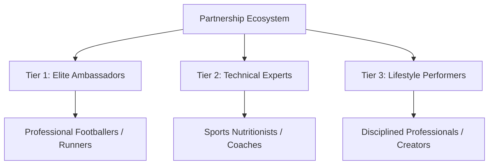
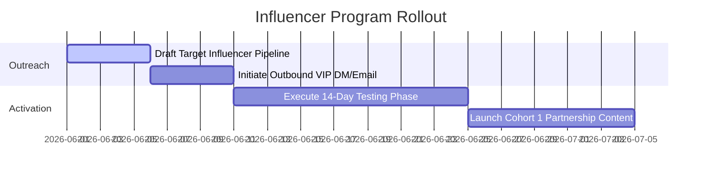

# ATRI INFLUENCER PLAYBOOK
## Division: Marketing OS | Document: 07_Influencer_Playbook.md

---

## 1. Specialist Agent Analysis & Alignment

### A. Influencer Marketing & PR Agent
Most supplement brands burn capital on macro-influencers who yield low-trust, transactional conversions. ATRI’s strategy centers around **High-Credibility micro and nano partnerships** (Sports nutritionists, professional athletic coaches, ironman athletes, semi-pro footballers). We recruit partners based on technical credibility rather than absolute follower count.

### B. Consumer Psychology Agent
Modern consumers know what paid promotions look like. When an elite athlete explains ATRI from an analytical perspective—highlighting how they personally audited the 4-level test certificates before agreeing to put it in their body—the promotion shifts from an ad to an authentic professional recommendation.

### C. Sports Nutrition & Product Strategy Expert
We provide our influencer partners with detailed "Science Decks" containing complete raw ingredient sourcing sheets, certificates of analysis, and formulation rationales. By equipping them with actual biochemical knowledge rather than empty advertising taglines, they represent the brand with scientific authority.

---

## 2. Influencer Tiers & Partnership Framework

### A. Tier 1: The Elite Ambassadors (High Credibility)
*   **Archetype:** Active professional Indian athletes (I-League/ISL footballers, national runners, competitive cyclists).
*   **Role:** Long-term brand faces, cinematic lifestyle integration, matchday nutrition highlights.
*   **Comp Structure:** Retainer + Product Allowance + Equity/Revenue Share options.

### B. Tier 2: The Technical Experts (Scientific Trust)
*   **Archetype:** Sports nutritionists, functional medicine practitioners, physical therapists, athletic coaches.
*   **Role:** Deep formulation breakdowns, educational video panels, gut-health Q&As, answering community skepticism.
*   **Comp Structure:** Affiliate Commission (15-20%) + High-Value Research Funding + Exclusive Cohort access.

### C. Tier 3: The Lifestyle Performers (Aspirational Growth)
*   **Archetype:** Aspirational corporate professionals, startup founders, creative entrepreneurs who showcase rigorous personal discipline and sport routines.
*   **Role:** Unboxing the TRI Fusion Pack, aesthetic daily routine reels, sharing "The Real Inside" lifestyle.
*   **Comp Structure:** Affiliate Commission (10-15%) + Product Gifting Seedings.

---

## 3. Strategic Recommendations

*   **Implement a Strict "Audit-First" Onboarding Protocol:** Do not allow any influencer to promote ATRI without them receiving, testing, and reviewing the TRI Fusion Pack for a minimum of 14 days. We only partner with authentic advocates.
*   **Cinematic Ambassador Video Profiles:** Instead of standard static grid posts, produce highly styled, documentary-like 60-second video profiles showcasing the ambassador’s physical struggle, training regimen, and clean recovery process.
*   **Exclude "Discount Code Shouting":** Never allow partners to post loud banners saying "USE CODE 20% OFF NOW." All partner conversions must be driven by premium storytelling and personalized, clean educational landing pages (`therealinside.com/partnername`).

---

## 4. Implementation Roadmap

1.  **Phase 1: Sourcing and Outreach (Week 1):** Vet and build a list of 50 target partners across Tier 1, 2, and 3. Send premium, non-transactional outbound messages.
2.  **Phase 2: The Testing Protocol (Weeks 2-3):** Deliver custom, personalized unboxing packages. Guide influencers through their 14-day gut-health and performance tracking period.
3.  **Phase 3: Content Deployment (Week 4+):** Go live with synchronized premium content, driving traffic to custom co-branded pages.

---

## 5. Standard Operating Procedures (SOPs)

### SOP-IN-01: Premium Influencer Outbound Outreach
*   **Objective:** Initiate authentic, highly respectful relationships with high-credibility partners.
*   **Channel Choice:** Direct, customized Instagram DM or professional Email.
*   **Execution Template (Instagram DM):**
    > "Hi [Name],
    >
    > We’ve been following your athletic journey, specifically how you break down your matchday preparation/running mechanics. 
    >
    > We are building ATRI—a sports nutrition brand dedicated strictly to gut-friendly performance and absolute formulation transparency. No gums, no thickeners, and independent 4-level testing.
    >
    > We don’t do standard transactional sponsorships. We want to send you our 3-day TRI Fusion Pack to test. We only partner with athletes who notice a physical improvement in their digestion and recovery over 14 days. 
    >
    > If you’re open to auditing our raw ingredients and testing it, where is the best place to ship your pack?
    >
    > - Vedansh Vijay, Founder"

---

## 6. Automation Opportunities

*   **Affiliate Portal & Tracking Automation:** Set up Shopify Collabs or Tolt.io. Once an influencer is accepted, it automatically provisions:
    1.  Their unique co-branded landing page URL.
    2.  Their personal dashboard tracking conversions and payouts.
    3.  Monthly automated payouts via Stripe.
*   **Automated VIP Re-engagement triggers:** When a partner's custom landing page receives a spike in traffic, a webhook automatically triggers a WhatsApp notification to the founder: *"Hey Vedansh, [Athlete Name]'s link just spiked with 150 unique visits. Drop them a voice note thanking them."*

---

## 7. Key Performance Indicators (KPIs)

*   **Influencer Reply-to-Outreach Rate:** Targeting a **>30%** positive response rate on premium outreach.
*   **Influencer Retention Rate:** Maintain **>80%** of onboarded partners as recurring multi-month brand advocates.
*   **Affiliate Partner Revenue Contribution:** Targeting influencer affiliate conversions to represent **>20%** of total D2C revenue within 90 days.

---

## 8. Execution Priorities

1.  **Priority 1 (Immediate):** Vet and compile the list of the first 30 micro-athlete profiles in India.
2.  **Priority 2 (High):** Standardize the co-branded partner landing page design template on Shopify.
3.  **Priority 3 (Medium):** Print-proof the custom handwritten "Founder Letter" included inside influencer unboxing seedings.
