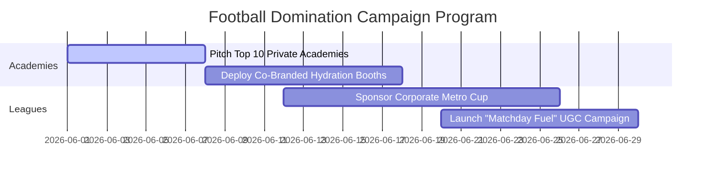

# THE REAL INSIDE FOOTBALL MARKETING PLAYBOOK
## Division: Marketing OS | Document: 08_Football_Marketing_Playbook.md

---

## 1. Specialist Agent Analysis & Alignment

### A. Football Marketing Specialist & Business Development Agent
Football is India's fastest-growing athletic and corporate sport, yet it lacks a dedicated high-performance nutrition brand. THE REAL INSIDE is positioned to own the **"Matchday Nutrition" category**. By embedding our products directly within academy training sessions, elite amateur leagues, and professional clubs, we establish immediate physical dominance over standard "gym-only" supplements.

### B. Sports Nutrition Expert
Football is a mixed aerobic-anaerobic endurance sport demanding intense sprinting, agility, and cognitive focus for 90+ minutes. General supplements don't solve this. True performance demands:
1.  **Pre-Match (TRI Pump Drake):** Endothelial vasodilation (sprint power) + cognitive focus (match intelligence).
2.  **Halftime (TRI Power BCAA):** Immediate electrolyte replenishment + muscle catabolism buffer + rapid gastric emptying (zero stomach heaviness).
3.  **Post-Match (True Whey):** Fast-absorbing protein to repair muscle tears + gut-friendly digestive enzymes.

### C. Consumer Psychology Agent
Modern football players, from amateur weekend warriors to academy stars, associate performance with premium gear (Nike, WHOOP, elite club kits). We must treat nutrition as **high-performance athletic gear**. We design our football activation materials to feel like premium, highly technical sporting equipment rather than wellness products.

---

## 2. The Matchday Nutrition Framework

THE REAL INSIDE’s core athletic offering is the **Matchday Performance Protocol**, structured around the TRI Fusion Pack:

```
  [-2 Hours: Pre-Match]        [Halftime: Support]        [Post-Match: Recover]
 ┌──────────────────────┐    ┌──────────────────────┐    ┌──────────────────────┐
 │   TRI PUMP DRAKE     │    │    TRI POWER BCAA    │    │      TRUE WHEY       │
 │                      │    │                      │    │                      │
 │ ⚡ Vasodilation      │───>│ 💧 Electrolytes      │───>│ 🔬 Rapid Protein     │
 │ 🧠 Match Focus       │    │ 🏃 Buffers Fatigue   │    │ 🛡️ Gut Enzymes       │
 │ 🔋 Glycogen Prep     │    │ 🚫 Zero Bloat        │    │ 🌱 Pure Grass-Fed    │
 └──────────────────────┘    └──────────────────────┘    └──────────────────────┘
```

1.  **The Pre-Match Load (-120 to -45 Mins):**
    *   *SKU:* TRI Pump Drake (Pre-Workout).
    *   *Mechanism:* L-Citrulline Malate expands blood vessels, improving oxygen delivery to muscles. Natural caffeine sharpens spatial awareness and reaction times.
2.  **The Halftime Replenish (Halftime Break):**
    *   *SKU:* TRI Power BCAA (2:1:1 + Hydration).
    *   *Mechanism:* Instantly absorbed branched-chain amino acids prevent muscle protein breakdown. Pure electrolytes replace sweat loss without causing stomach cramps or bloating, ensuring explosive performance in the second half.
3.  **The Post-Match Recovery (Within 45 Mins):**
    *   *SKU:* True Whey (Protein & Recovery).
    *   *Mechanism:* Clean, grass-fed whey concentrate digests rapidly with bromelain/papain, delivering essential amino acids directly to torn muscle fibers to accelerate recovery.

---

## 3. Strategic Recommendations

*   **Establish the "TEAM THE REAL INSIDE Academy Alliance":** Partner with the top 10 elite private football academies in metro cities (Mumbai, Bengaluru, Delhi NCR, Goa). Provide co-branded halftime hydration stations, supplying academy coaches and youth players with technical hydration setups.
*   **Target the Corporate Football Leagues:** Sponsor high-ticket corporate football tournaments (e.g., Corporate 5-a-side leagues). Offer the TRI Fusion Pack as part of the official tournament registration kit to capture high-income corporate professionals.
*   **Develop "Matchday Fuel" Educational Reels:** Create highly visual reels mapping out the exact nutrition and hydration schedules of professional footballers, contrasting it with the poor nutrition habits of amateur players.

---

## 4. Implementation Roadmap



1.  **Stage 1: Partner Acquisition (Week 1):** Vet and pitch elite academy directors, providing them with technical formulation sheets and sampling kits.
2.  **Stage 2: Operational Setup (Weeks 2-3):** Deliver halftime hydration dispensers, co-branded sports bottles, and TRI Fusion test kits to academy players.
3.  **Stage 3: Consumer Scale (Week 4+):** Leverage league partnerships to drive massive D2C traffic, utilizing player-led video testimonials.

---

## 5. Standard Operating Procedures (SOPs)

### SOP-FT-01: Academy Halftime Hydration Setup
*   **Objective:** Standardize the premium physical brand presence at partner academies and tournaments.
*   **Execution Protocol:**
    1.  **Visual Setup:** Position two clean, matte obsidian THE REAL INSIDE hydration dispensers at the pitch touchline. Keep all generic plastic bottles out of sight.
    2.  **Mixing Precision:** Mix TRI Power BCAA strictly according to technical ratios (1 scoop per 400ml water). Ensure water is chilled but not freezing, to maximize stomach gastric emptying and absorption.
    3.  **Educational Collateral:** Ensure all participants receive a co-branded water bottle and a cardsheet detailing the 3-Step Matchday Protocol and the 4-level test batch report.

---

## 6. Automation Opportunities

*   **Academy Replenishment Automation:** Connect the Academy Ambassador portal to a Shopify automated subscription system. When an academy's hydration inventory drops below a preset weight or count (tracked via a simple shared Google Sheet or portal form), it automatically triggers a fresh freight order of bulk BCAA.
*   **Football Weather Hydration Alerts:** Set up a localized weather API automation. When high temperature/humidity warnings are forecast for amateur match days (Saturdays/Sundays), the system automatically triggers localized WhatsApp notifications and targeted Meta ads to players, detailing sweat rate calculation formulas and hydration guidelines.

---

## 7. Key Performance Indicators (KPIs)

*   **Academy Partner Penetration:** Onboard **10+ elite academies** within the first 60 days of campaign launch.
*   **Matchday Brand Recall:** Targeting **>45%** top-of-mind brand recall when academy and tournament players are asked: "What is the best hydration supplement for football?"
*   **Corporate Cohort Trial Conversion:** Achieve a **>22% conversion rate** from corporate tournament sampling packs to recurring online customers.

---

## 8. Execution Priorities

1.  **Priority 1 (Immediate):** Draft and design the physical "Matchday Nutrition Protocol" cardsheet included in tournament trial packs.
2.  **Priority 2 (High):** Pitch the THE REAL INSIDE Halftime Hydration Program to the top 3 high-profile soccer leagues in Mumbai and Bengaluru.
3.  **Priority 3 (Medium):** Script a cinematic video feature with an ISL / I-League professional footballer auditing the THE REAL INSIDE batch tests.
