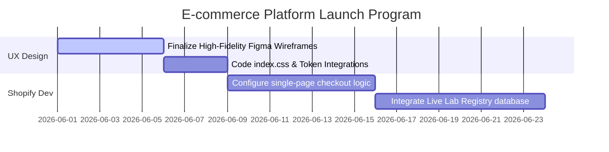

# ATRI WEBSITE PLAYBOOK
## Division: Growth OS | Document: 09_Website_Playbook.md

---

## 1. Specialist Agent Analysis & Alignment

### A. Website UX/UI, Conversion Optimization (CRO) & E-commerce Agents
ATRI's website must bridge visual luxury with high-performance conversion mechanics. Aligned with the Pomelli Brand Book, the interface uses a dark canvas (Deep Obsidian) offset by copper highlights (Canyon Clay) and elegant serif headings (Playfair Display). We eliminate all standard, cluttered e-commerce patterns in favor of clean space, smooth micro-animations, and a highly streamlined single-page checkout loop.

### B. Consumer Psychology Agent
Modern buyers seek trust, fast loading speeds, and structural clarity. The homepage layout follows a **"Trust Stack" hierarchy**: Hook -> Visual Demo -> Formulation Audit -> Lab Verification Registry -> Trial Pack Conversion module. By displaying independent lab certifications directly within the product purchase card, we neutralize buying anxiety before the click.

### C. Sports Nutrition & Product Strategy Expert
The D2C website functions as an educational portal. Product pages must go beyond nutrition facts; they must clearly articulate biological benefits (e.g., gastric emptying rate, muscle protein synthesis, amino acid buffering). We replace complex sports jargon with highly clean, visual anatomy diagrams.

---

## 2. Sitemap & Wireframe Framework

### A. Master Sitemap Architecture
*   **1. Primary Landing Page (Homepage / Funnel):** Core Brand Narrative + TRI Fusion Pack D2C Hub.
*   **2. Batch Lab Registry (Science Hub):** Searchable index of all 4-Level batch test PDF certificates.
*   **3. Performance Products (Collection):** True Whey, TRI Power BCAA, TRI Pump Drake.
*   **4. Matchday Philosophy (Football Portal):** Science, partner academies, and the athlete nutrition protocol.
*   **5. Founder's Build (Narrative page):** Vedansh Vijay’s building-in-public stories and philosophy.

---

### B. Mobile Wireframe Wire-mapping (The TRI Fusion Pack Landing Page)

```
┌────────────────────────────────────────┐
│ [≡] ATRI    THE REAL INSIDE   [🛒]     │  <-- Header: Dark Obsidian, Playfair logo
├────────────────────────────────────────┤
│                                        │
│          CINEMATIC BOX IMAGE           │  <-- Premium unboxing render (soft-touch)
│                                        │
├────────────────────────────────────────┤
│ Playfair Display Header                │
│ "WHAT'S INSIDE MATTERS."               │  <-- Heading
│                                        │
│ Montserrat Subtext                     │
│ 3 Days. 3 Gut-Friendly Formulations.   │  <-- Core Value Prop
│                                        │
│  [ TRY THE FUSION PACK: ₹599 ]         │  <-- Primary CTA (Canyon Clay Button)
├────────────────────────────────────────┤
│  ✓ 4-Level Tested  ✓ Zero Bloat        │  <-- Mini Trust Badges
├────────────────────────────────────────┤
│                                        │
│    FORMULA TRANSPARENCY AUDIT GRID     │  <-- Interactive grid detailing ingredients
│                                        │
├────────────────────────────────────────┤
│          LIVE BATCH REGISTRY           │
│  [ Enter Batch Code ] -> View PDF Lab  │  <-- Radical Transparency input
└────────────────────────────────────────┘
```

---

### C. High-Ticket Subscription Funnel
We utilize the **"Subscribe & Elevate" loop**. After the customer completes their 3-day TRI Fusion Pack trial, a personalized post-purchase funnel is activated:
*   *Step 1:* Email & WhatsApp checkout link sent on Day 3 of trial: "Ready to make performance a habit?"
*   *Step 2:* Option to subscribe to bulk **True Whey + TRI Power BCAA + TRI Pump Drake** at a customized 15% discount.
*   *Step 3:* Custom frequency intervals (30, 45, 60 days) to match their personal training schedules.

---

## 3. Strategic Recommendations

*   **Implement a 1-Step Slide-Out Cart:** Never redirect users to a separate cart page. Use a sleek, slide-out drawer containing cart items, a visual threshold indicator showing how close they are to unlock free shipping, and a direct Google Pay/Apple Pay express checkout button.
*   **Embed Interactive "Ingredient Anatomy" Hotspots:** On bulk product pages, feature an interactive 3D package render. Clicking on a section highlights key ingredients (e.g., clicking on "True Whey" highlights the exact dosage of digestive enzymes and grass-fed concentrate).
*   **Host the Live Batch Registry Search Module:** Feature a prominent search bar on the header where users can input their physical box batch number to instantly display independent laboratory test verification PDFs.

---

## 4. Implementation Roadmap



1.  **Phase 1: High-Fi Design & Front-End Setup (Week 1):** Complete full Figma screens for desktop/mobile. Implement custom CSS variables matching the Pomelli Brand Book guidelines.
2.  **Phase 2: Checkout & Database Dev (Week 2):** Build out the custom slide-out checkout logic and integration with headless Stripe/Shopify APIs.
3.  **Phase 3: Launch Optimization (Weeks 3-4):** Execute page speed tests, set up hotjar tracking, and launch sandbox A/B tests on landing pages.

---

## 5. Standard Operating Procedures (SOPs)

### SOP-WE-01: Product Page Upload & Compliance
*   **Objective:** Ensure new products uploaded to the website conform strictly to ATRI's visual and CRO standards.
*   **Execution Steps:**
    1.  **Visual Asset Verification:** Ensure the primary product image uses a deep obsidian canvas backdrop. Shadows must be soft-brushed; reflections must have copper hues.
    2.  **Copy Formatting:**
        *   Headings MUST use `Playfair Display` in `#FBFBFB` or `#B85F48`.
        *   Product features must be presented as a clean bullet list using `Montserrat` and `#F8D7D9`.
    3.  **Technical Specification Entry:** The product details accordion must explicitly feature: Raw Sourced Ingredients, Independent Test Verification PDF, Digestive/Gut-friendly Enzymatic profiles, and Mixing Guidelines.

---

## 6. Automation Opportunities

*   **Interactive Cart Recovery Automation:** Set up Klaviyo and Shopify trigger flows. When a user abandons the TRI Fusion Pack cart:
    1.  An automated WhatsApp message is sent within 15 minutes, featuring a personalized unboxing video of the box.
    2.  An email is sent within 1 hour, presenting a direct co-founder note from Vedansh Vijay answering common gut-health FAQs.
*   **Dynamic Page Speed Optimization:** Deploy Cloudflare Page Speed automations. The system automatically compresses incoming UGC assets, lazy-loads non-essential code, and serves highly optimized WebP images, keeping mobile load time **under 1.8 seconds**.

---

## 7. Key Performance Indicators (KPIs)

*   **Mobile Conversion Rate:** Target blended mobile conversion rate of **>4.2%** on the TRI Fusion Pack landing page.
*   **Average Page Load Speed (LCP):** Keep Largest Contentful Paint under **1.5 seconds** on mobile devices.
*   **Checkout Completion Rate:** Target **>78%** of users completing payment once they enter the slide-out cart.

---

## 8. Execution Priorities

1.  **Priority 1 (Immediate):** Setup the basic HTML/CSS variables and file paths inside the Shopify/Vite development repository.
2.  **Priority 2 (High):** Implement the frictionless slide-out checkout funnel on the trial page.
3.  **Priority 3 (Medium):** Build out the searchable laboratory registry database and import the first batch's PDF files.
