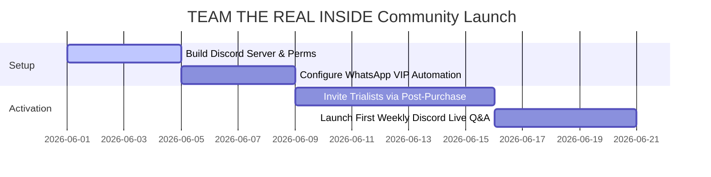

# THE REAL INSIDE COMMUNITY PLAYBOOK
## Division: Growth OS | Document: 10_Community_Playbook.md

---

## 1. Specialist Agent Analysis & Alignment

### A. Community Building, Retention & CRM Agents
THE REAL INSIDE's community ecosystem is our primary defense against rising acquisition costs. "TEAM THE REAL INSIDE" is designed not as a generic broadcast feed, but as an exclusive digital club for modern performance culture. The community provides physical utility (training coaching, exclusive academy events, diet design calculators) that drives high customer retention.

### B. Consumer Psychology Agent
Modern high-performers seek **association and social identity**. By aligning themselves with THE REAL INSIDE, they visually assert themselves as disciplined, performance-oriented, and scientific. We gamify the ambassador experience to tap into status triggers (e.g., unlocking limited-edition copper shaker bottles or exclusive athletic coaching sessions).

### C. Sports Nutrition & Football Specialist
The community serves as a support squad. Members receive direct advice from verified sports nutritionists. Rather than researching incorrect supplement dosages online, they have immediate access to technical sports scientists who help design custom training and recovery protocols.

---

## 2. TEAM THE REAL INSIDE Channel Architecture

```
                       [TEAM THE REAL INSIDE ECOSYSTEM]
                       /        |        \
                      /         |         \
         [WhatsApp VIP]   [Telegram Hub]   [Exclusive Discord]
         * Delivery Tracking * General Chat   * Training Logs
         * Subscription Alerts * Match Prep   * Science Q&A
         * VIP Early-Access * Marathon Tips  * Mastermind Cohorts
```

### A. The WhatsApp VIP Gateway (Operational Friction-Free)
*   **Target:** All TRI Fusion Pack trialists and monthly active subscribers.
*   **Purpose:** Transactional alerts, high-value nutritional digests, unboxing advice, and instant customer service queries.
*   **Operational Style:** Professional, clean, and interactive.

### B. The Telegram Athletic Arena (Broad Action & Culture)
*   **Target:** Aspiring local football players, runners, and fitness enthusiasts in metro hubs.
*   **Purpose:** Local meetup coordination, sharing weekly training achievements, community challenges (e.g., "5K sprint time verification"), and general athletic networking.
*   **Operational Style:** High energy, organic, disciplined, athlete-led.

### C. The Exclusive Discord Mastermind (High Retention & Education)
*   **Target:** Verified long-term brand advocates, Tier 1/2 ambassadors, and high-frequency bulk subscribers.
*   **Purpose:** Live video Q&As with sports nutritionists, direct feedback channel with Vedansh Vijay (Founder), structural diet templates, and specialized masterminds.
*   **Operational Style:** Premium, highly educational, focused.

---

## 3. Strategic Recommendations

*   **Gamify the TEAM THE REAL INSIDE Ambassador Tiers:** Implement a structured points system based on customer activity:
    1.  *Tier 1: Explorer (Entry):* Purchase Fusion Pack. Unlocks basic nutrition tools database.
    2.  *Tier 2: Performer (Bulk/Repeat):* Repurchase 2x bulk tubs. Unlocks limited-edition matte obsidian copper-stamped THE REAL INSIDE shaker.
    3.  *Tier 3: Elite Advocate (10+ Refers or ISL Academy status):* Unlocks direct video consultations with sports scientists and exclusive co-branded apparel.
*   **Host Weekly "Science Check-Ins":** Run a recurring live Discord/Telegram audio call on Sunday evenings where a technical sports nutritionist answers members' questions regarding bloating, recovery plateaus, or training pacing.
*   **Double-Sided Referral Loop:** Standardize a transparent referral program: *"Gift ₹150 off a TRI Fusion Pack to your team captain or running partner. You receive ₹150 in THE REAL INSIDE points towards your next True Whey purchase once they complete their trial."*

---

## 4. Implementation Roadmap



1.  **Phase 1: Foundation Setup (Week 1):** Deploy the clean Discord server permissions, build the custom WhatsApp VIP sequences, and design visual community assets.
2.  **Phase 2: Activation Integration (Week 2):** Connect Shopify post-purchase triggers to automatically invite customers to join relevant channels.
3.  **Phase 3: Event Engine Rollout (Week 3+):** Launch weekly educational Q&As and initiate the double-sided referral program.

---

## 5. Standard Operating Procedures (SOPs)

### SOP-CM-01: Community Moderation & Voice Verification
*   **Objective:** Keep channels highly constructive, disciplined, and brand-aligned, preventing spam.
*   **Execution Protocol:**
    1.  **Spam Filter:** Block all external links, promotional discount codes, and unrelated fitness channels.
    2.  **Voice Standards:** Exclude all toxic "gym-bro" arguments or steroid discussions. Moderation must align with THE REAL INSIDE voice parameters: calm, intelligent, scientific, encouraging.
    3.  **Medical Queries:** If a community member asks a highly complex medical question:
        *   *Action:* Direct them immediately to the Tier 2 sports nutritionist channel.
        *   *Compliance:* Remind them: "THE REAL INSIDE is a high-performance supplement, not a medical treatment. Consult your sports doctor before significant changes."

---

## 6. Automation Opportunities

*   **Automated Ambassador Onboarding Loop:** Set up a webhook trigger. When a customer passes their Tier 2 ambassador thresholds in Shopify:
    1.  Zapier automatically posts a customized welcome graphic in the Discord lobby.
    2.  An automated warehouse freight ticket is generated to ship them their reward (Limited Shaker).
    3.  Their personal Discord role is automatically upgraded to "Performer," unlocking private channels.
*   **AI Community Question Responder:** Integrate a custom semantic AI assistant inside the Discord server's `#nutrition-science` channel. When members ask basic questions (e.g., "what is the best timing for TRI Power BCAA?"), the AI instantly queries the THE REAL INSIDE scientific database and responds with a perfectly formatted, brand-aligned educational explanation.

---

## 7. Key Performance Indicators (KPIs)

*   **Active Member Rate:** Maintain a **>40%** weekly active user (WAU) rate inside the Discord server.
*   **Referral Contribution:** Targeting referrals to drive **>15%** of total TRI Fusion Pack trials.
*   **Subscriber Retention Rate:** Target a monthly churn rate of **<4.5%** for community-active subscribers compared to **>8%** for non-community buyers.

---

## 8. Execution Priorities

1.  **Priority 1 (Immediate):** Provision the core Discord server layout and set up the automatic verification system for buyers.
2.  **Priority 2 (High):** Standardize the referral engine dashboard on the Shopify store.
3.  **Priority 3 (Medium):** Create the welcome onboarding PDF guide for new TEAM THE REAL INSIDE community members.
