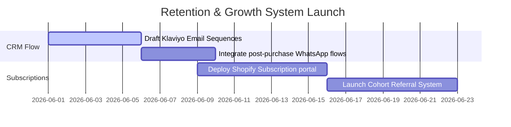

# THE REAL INSIDE GROWTH PLAYBOOK
## Division: Growth OS | Document: 11_Growth_Playbook.md

---

## 1. Specialist Agent Analysis & Alignment

### A. D2C Growth, E-commerce & Retention Agents
LTV:CAC optimization is the core financial engine of THE REAL INSIDE. High acquisition costs on trial products are only viable if we execute a high-converting, post-purchase cohort retention protocol. We target a **Customer Lifetime Value (LTV) to Customer Acquisition Cost (CAC) ratio of >4:1** over 180 days by turning one-time trialists into recurring bulk subscription advocates.

### B. Consumer Psychology Agent
Retention begins at the moment of unboxing. When the TRI Fusion Pack arrives, the physical sensory touchpoints (the premium textured cardboard, copper-foiled typography, co-founder's note, and clear sachet layouts) trigger intense post-purchase satisfaction, instantly dissolving buying skepticism and paving the path for bulk repurchases.

### C. Sports Nutrition & Supplement Industry Expert
Supplements yield results only through consistency. Our growth funnel is structured around **habit formation loops**. By providing structural weekly athletic calendars, physical dosage cups, and personalized habit-tracking SMS check-ins, we transition the customer's mindset from "trying a supplement" to "integrating an essential athletic recovery routine."

---

## 2. Retention & Conversion Lifecycle Funnel

```
 ┌──────────────────────┐      [DAY 1: Tactile Unboxing]
 │  TRI FUSION TRIAL    │ ───> * Matte soft-touch textured packaging
 │   SKU: ₹599 Purchase │      * Independent 4-level test registry QR
 └──────────────────────┘      * "Try it first. Love it always" card
            │
            ▼
 ┌──────────────────────┐      [DAY 2-4: Habit Formation]
 │ POST-PURCHASE CRM    │ ───> * Day 2: WhatsApp guide on pre-workout timings
 │  WhatsApp & Email    │      * Day 3: Football/Athletic recovery tips
 └──────────────────────┘      * Day 4: Post-trial satisfaction feedback
            │
            ▼
 ┌──────────────────────┐      [DAY 5-10: Subscription Trigger]
 │ SUBSCRIBE & ELEVATE  │ ───> * VIP discount to monthly bulk tubs
 │   Bulk SKU Upsell    │      * Customized intervals (30/45/60 days)
 └──────────────────────┘      * Free limited-edition shaker unlock
```

### Step 1: The Premium Tactile Unboxing Experience
*   **Physical Box:** Premium rigid cardboard finished with soft-touch matte lamination. Design features copper-foil swirls and high-contrast Montserrat typography.
*   **The Collateral Inside:**
    1.  *A Founder Letter:* An authentic, clean note from Vedansh Vijay detailing the THE REAL INSIDE mission, printed in premium serif Playfair Display on textured cardstock.
    2.  *The 3-Step Matchday Cardsheet:* A beautifully styled infographic detailing exactly when to take each sachet (Pre-workout, Halftime BCAA, Post-workout Whey).
    3.  *The Lab Test Verification:* A prominent QR code linking directly to the batch's independent chemical verification report.

### Step 2: Post-Purchase Lifecycle Retention Flows (WhatsApp & Email)
*   **Day 1 (Delivery Day):** *"Welcome to TEAM THE REAL INSIDE. Your trial pack has arrived. Scan the QR code inside to view your batch's independent lab reports. What's inside matters."*
*   **Day 2 (TIMING & SCIENCE):** *"Pre-workout timing is everything. For maximum muscle perfusion and stamina, drink TRI Pump Drake exactly 30 minutes before your workout or kickoff."*
*   **Day 3 (HALFTIME HYDRATION):** *"Why standard sports drinks cause cramps: high sugars. TRI Power BCAA uses pure electrolytes and zero gums to buffer fatigue with rapid gastric emptying."*
*   **Day 4 (THE UPGRADE TRIGGER):** *"How did your body feel? Ready to make physical performance a habit? Claim your 15% VIP discount on monthly bulk tubs of True Whey + BCAA + Pre-Workout."*

---

## 3. Strategic Recommendations

*   **Deploy the "Subscribe & Elevate" Funnel:** Focus all email/WhatsApp retention automations on converting trialists to active monthly subscribers. Offer standard benefits: 15% discount, priority batch shipping, free limited-edition copper shaker bottles, and direct nutrition coaching access.
*   **Execute the "Failed-Batch Transparency" Campaign:** If a batch of raw ingredients fails our rigorous 4-level independent testing, have Vedansh Vijay document it. Share the raw reports, showing that we chose to destroy the inventory rather than sell a sub-par batch, proving absolute trust.
*   **Build the Ambassador Affiliate Network:** Provide active Tier 2/3 advocates with personalized 10% discount codes to share. Reward them with 15% recurring commissions, turning our customer base into a decentralized sales team.

---

## 4. Implementation Roadmap



1.  **Phase 1: CRM & Email Integration (Week 1):** Map out and draft all post-purchase email and WhatsApp triggers, ensuring 100% voice alignment.
2.  **Phase 2: Subscription Platform Setup (Week 2):** Launch the recurring billing framework and customize customer subscription dashboards.
3.  **Phase 3: Affiliate & Scaling Launch (Weeks 3-4):** Recruit Tier 3 advocates and deploy double-sided referral programs.

---

## 5. Standard Operating Procedures (SOPs)

### SOP-GR-01: VIP Subscription Cancellation Retargeting
*   **Objective:** Handle subscription cancellations gracefully while maximizing reactivation rates.
*   **Execution Steps:**
    1.  **Cancellation Friction Minimization:** Provide a clean, direct cancellation link inside the dashboard (no hidden buttons). This builds trust.
    2.  **Reason Profiling Survey:** Capture the reason: *Gastric issues, excess inventory, cost, flavor preference*.
    3.  **Dynamic Mitigation Trigger:**
        *   *If "Excess Inventory":* Automatically offer a "Skip Next Shipment" or "Change Frequency to 60 days" option.
        *   *If "Flavor Preference":* Instantly offer a free flavor switch for the upcoming shipment.
        *   *If "Cost":* Offer a one-time 20% discount or down-sell to the TRI Fusion Pack trial tier.

---

## 6. Automation Opportunities

*   **Predictive Churn Risk Alerts:** Set up an automation between Shopify and Klaviyo. If a recurring subscriber does not log into their community portal or click our educational emails for 21 consecutive days, the system automatically tags them as "High Churn Risk" and triggers a personal check-in SMS from Vedansh: *"Hey [Name], just checking in on your athletic recovery progress this month. Drop me a reply if you need any adjustments to your nutrition plan."*
*   **Automated Box Delivery WhatsApp Sync:** Integrate Shopify with a WhatsApp Business API trigger. When shipping status updates to "Delivered," it instantly triggers the premium unboxing video guide to their phone, ensuring they experience the unboxing protocol immediately.

---

## 7. Key Performance Indicators (KPIs)

*   **Customer Lifetime Value (LTV):** Target LTV of **>₹8,500** per customer over 180 days.
*   **Subscription Retention Rate:** Maintain active subscription retention at **>91.5%** month-over-month.
*   **Trial-to-Bulk Cohort Conversion:** Convert **>20%** of TRI Fusion Pack trialists to bulk monthly active buyers within 30 days.

---

## 8. Execution Priorities

1.  **Priority 1 (Immediate):** Map and draft the 4-part post-purchase WhatsApp campaign for TRI Fusion Pack unboxing.
2.  **Priority 2 (High):** Standardize the structural design layouts for bulk product unboxing packages.
3.  **Priority 3 (Medium):** Deploy the dynamic subscription frequency portal on e-commerce dashboards.
