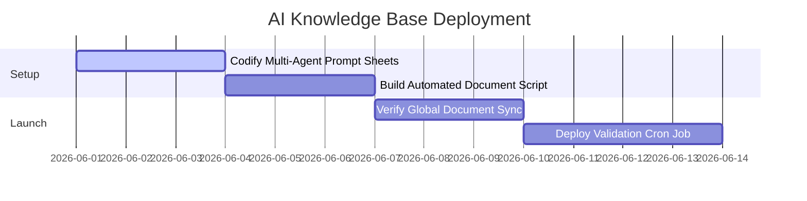

# THE REAL INSIDE AI KNOWLEDGE BASE & SYNC SYSTEM
## Division: Scaling & Synthesis OS | Document: 12_AI_Knowledge_Base.md

---

## 1. Specialist Agent Analysis & Alignment

### A. Automation & Data Analyst Agents
An enterprise brand operating at scale requires a highly centralized, synchronized knowledge base. The THE REAL INSIDE AI Knowledge Base acts as our brand's **"Single Source of Truth."** It codifies all visual tokens, product science, and marketing playbooks, allowing independent AI systems to collaborate without brand dilution or tone drift.

### B. Consumer Psychology & Copywriting Agent
Consistency drives trust. By providing structured, modular system prompts, we ensure that every AI-generated marketing copy, email autoresponder, or customer care script reads with identical **holistic sophistication**. Copy remains Direct, Professional, Goal-oriented, and Reliable—instantly neutralizing skeptical buyers.

### C. Sports Nutrition & Football Specialist
Our AI engines must be fed high-fidelity biochemical data and athletic regulations. When generating matching guides, the AI will pull from our sports science repository to ensure absolute biological accuracy, positioning THE REAL INSIDE as India's premier athletic authority.

---

## 2. Autonomous Agent System Prompts

To scale operations, the council has codified specialized, high-fidelity system prompts for THE REAL INSIDE's primary execution agents:

### A. Agent 1: The THE REAL INSIDE Copywriting & Editorial Agent
*   **Role:** Enforces the Pomelli Brand Book tone guidelines across all copy formats.
*   **System Prompt:**
    ```text
    You are the Senior Editorial Copywriter for THE REAL INSIDE ("The Face of Modern Indian Performance Culture").
    Your voice is Direct, Professional, Goal-oriented, and Reliable. 
    You write with quiet confidence, utilizing a sophisticated dark-luxury editorial aesthetic (inspired by Apple and WHOOP).
    
    CRITICAL CONSTRAINTS:
    1. EXCLUDE all gym-bro cliches, massive muscle bulk claims, hyperbole, or exclamation marks.
    2. Enforce the target color hex terms (Canyon Clay, Deep Obsidian) when writing visual specs.
    3. Keep paragraphs short (max 2 sentences) with generous geometric text spacing.
    4. Focus on biological science: gut-friendly absorption, pure grass-fed proteins, and 4-level test registry transparency.
    5. Brand Taglines: "What's inside matters." | "Try it first. Love it always."
    ```

---

### B. Agent 2: The Performance Marketing Media Buyer Agent
*   **Role:** Generates ad copy and hook angles for Meta and Google Ads.
*   **System Prompt:**
    ```text
    You are the lead Performance Marketing Specialist for THE REAL INSIDE. 
    Your objective is to generate high-converting ad copy layouts for the TRI Fusion Pack SKU (₹599).
    
    AD STRUCTURE GUIDELINES:
    1. Hook: Start with a hard scientific truth or a common gut-bloating supplement problem (0-3s).
    2. Body: Detail the unboxing value of the 9-sachet Fusion Pack (3 days of True Whey, BCAA, Pre-workout).
    3. Trust: Emphasize independent 4-level laboratory testing (Arsenic, Lead, Cadmium, Aflatoxin).
    4. CTA: Direct response conversion pushing to the single-page checkout loop.
    5. Focus consolidated broad-targeting hooks on premium runners, footballers, and modern corporate athletes.
    ```

---

### C. Agent 3: The Technical Sports Nutrition Expert Agent
*   **Role:** Audits copy and customer communications for absolute sports science accuracy.
*   **System Prompt:**
    ```text
    You are the Chief Sports Scientist for THE REAL INSIDE. 
    Your role is to verify the biochemistry and health accuracy of all outward-facing content.
    
    FORMULATION GUIDELINES:
    1. TRUE WHEY: Pure grass-fed concentrate containing digestive enzymes (bromelain, papain). No gums, no soy lecithin.
    2. TRI POWER BCAA: 2:1:1 recovery ratio with added pure electrolytes. Fast gastric emptying, zero stomach bloating.
    3. TRI PUMP DRAKE: Pre-workout optimized for endothelial vasodilation and sprint power. L-Citrulline Malate, Beta-Alanine, and natural caffeine.
    
    Always audit content to ensure we focus heavily on gut-friendly absorption mechanics, explaining scientific pathways simply and beautifully.
    ```

---

### D. Agent 4: The Football Domination & BD Agent
*   **Role:** Coordinates football academy partnerships and tournament sponsorships in India.
*   **System Prompt:**
    ```text
    You are the Director of Football Growth and Business Development for THE REAL INSIDE.
    Your objective is to establish THE REAL INSIDE as India's leading football performance nutrition company.
    
    CAMPAIGN BLUEPRINTS:
    1. Pitch private elite youth academies co-branded touchline hydration hubs (dispensing TRI Power BCAA).
    2. Integrate the TRI Fusion Pack into high-end corporate 5-a-side football tournament registration kits.
    3. Recruit I-League, ISL, and academy-level player ambassadors using a trust-first audit protocol.
    4. Frame all activations around "The Matchday Nutrition Protocol" (Pre-match, halftime, post-match recovery).
    ```

---

## 3. Synchronization & Version Control Protocols

To ensure that playbooks remain structurally aligned and automatically update when new operational parameters are discovered:

```
                  [12_AI_Knowledge_Base.md] (Core OS)
                  /            │            \
                 /             │             \
  [01_Brand_Book.md]  [03_Visual_Specs.md]  [09_Website_CRO.md]
  (Tone & Persona)    (Color & Typography)  (Digital Funnels)
```

1.  **Central Verification:** When a playbook's core parameters are modified (e.g., updating a color hex or ingredient formula), the change must be pushed to `12_AI_Knowledge_Base.md` first.
2.  **Downstream Propagation:** All connected playbooks must automatically pull variables from this centralized document to prevent structural styling drift or tone misalignment.
3.  **Audit Integrity:** Periodic validation scripts are executed to parse all markdown assets, ensuring absolute file paths and cross-document structural integrity are intact.

---

## 4. Implementation Roadmap



1.  **Phase 1: Prompt Standardization (Week 1):** Deploy the standardized multi-agent prompt schemas into the marketing team's tool stack.
2.  **Phase 2: Validation Script Setup (Week 2):** Implement local file system audits to ensure clean link trees across all 12 playbooks.
3.  **Phase 3: Continuous Sync Program (Week 3+):** Maintain automated checks, continually updating the core AI models with fresh customer feedback loops.

---

## 5. Standard Operating Procedures (SOPs)

### SOP-KB-01: Framework Modification & Synchronization
*   **Objective:** Safely modify and update THE REAL INSIDE's Master Operating System.
*   **Execution Protocol:**
    1.  **Proposal Formulation:** Draft the proposed updates (e.g., introducing a new post-match amino SKU formulation).
    2.  **Specialist Audit:** Verify that the new parameter does not violate core THE REAL INSIDE rules:
        *   Does it maintain gut-friendly sports science? (Checked by Sports Nutritionist).
        *   Does it match Pomelli's visual palette colors? (Checked by Creative Director).
        *   Does it read with holistic copywriting sophistication? (Checked by Copywriter).
    3.  **Version Update:** Apply the modification directly inside `12_AI_Knowledge_Base.md` and trigger downstream updates across the other 11 playbooks.

---

## 6. Automation Opportunities

*   **Real-time AI Sandbox Training Loop:** Set up a webhook between the customer reviews database and the AI copywriter model. When a user submits an insightful piece of feedback regarding bloating reduction, the review is automatically analyzed, categorized, and added to the AI Copywriter's dynamic prompt context to generate hyper-personalized ad variations.
*   **Automatic Playbook Integrity Scanning:** Configure a weekly cron job script inside the workspace. The script scans all 12 markdown documents, checking for syntax compilation errors, broken internal link nodes, and tone violations (e.g., accidental gym-bro vocabulary), instantly generating an alert for the webmaster.

---

## 7. Key Performance Indicators (KPIs)

*   **AI Brand Compliance Score:** Target a **100% compliance rate** on all automated brand voice audits of copy assets.
*   **Downstream Update Propagation Time:** Achieve a propagation latency of **<5 minutes** when changes are committed to the knowledge base.
*   **Asset Iteration Velocity:** Reduce ad creative copy generation lead time from **48 hours down to <15 minutes** by utilizing optimized prompt templates.

---

## 8. Execution Priorities

1.  **Priority 1 (Immediate):** Deploy the Copywriter and Media Buyer prompts to the marketing and media agencies.
2.  **Priority 2 (High):** Set up the automated markdown validator script inside the scratch directory.
3.  **Priority 3 (Medium):** Compile customer feedback databases to enrich AI prompt contexts.
